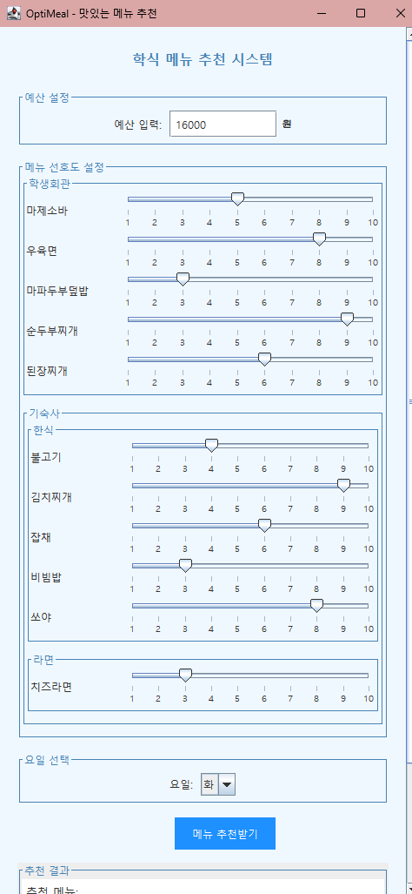
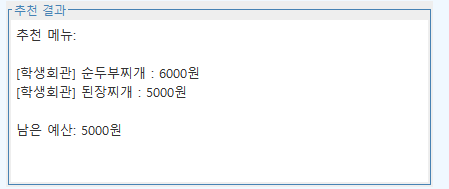

# OptiMeal - Meal Recommendation System

OptiMeal is a meal recommendation system designed for students. It takes user input such as budget and preferences and recommends optimized menus based on the selected day of the week. With an intuitive GUI and an efficient recommendation algorithm, OptiMeal makes meal selection easy and enjoyable.

## Features
- **Meal Management**: Manage meal details, including name, price, and preference score.
- **Day-Specific Recommendations**: Filter and recommend meals based on the selected day.
- **User-Friendly UI**: Input budget, select a day, and adjust preferences using sliders.
- **Greedy Algorithm-Based Optimization**: The system uses a greedy algorithm to prioritize meals with the highest preference-to-price ratio within the given budget.
- **Stylish Theme**: Clean design and comfortable color themes for a pleasant user experience.

## Algorithm Details
OptiMeal employs a **Greedy Algorithm** to recommend meals.  
The algorithm works as follows:
1. Each meal is evaluated based on its **preference-to-price ratio**.
2. Meals are sorted in descending order of this ratio.
3. Starting from the top of the list, the system selects meals one by one, ensuring the total cost stays within the user’s budget.

---

## Usage Example

Below are screenshots of the OptiMeal program in action:

  
  

---

## Contributors
This project was developed with contributions from the following members:
1. **김혁진** *(Main Developer)*  
2. **조혜린**  
3. **박윤서**  
4. **이은주**  
